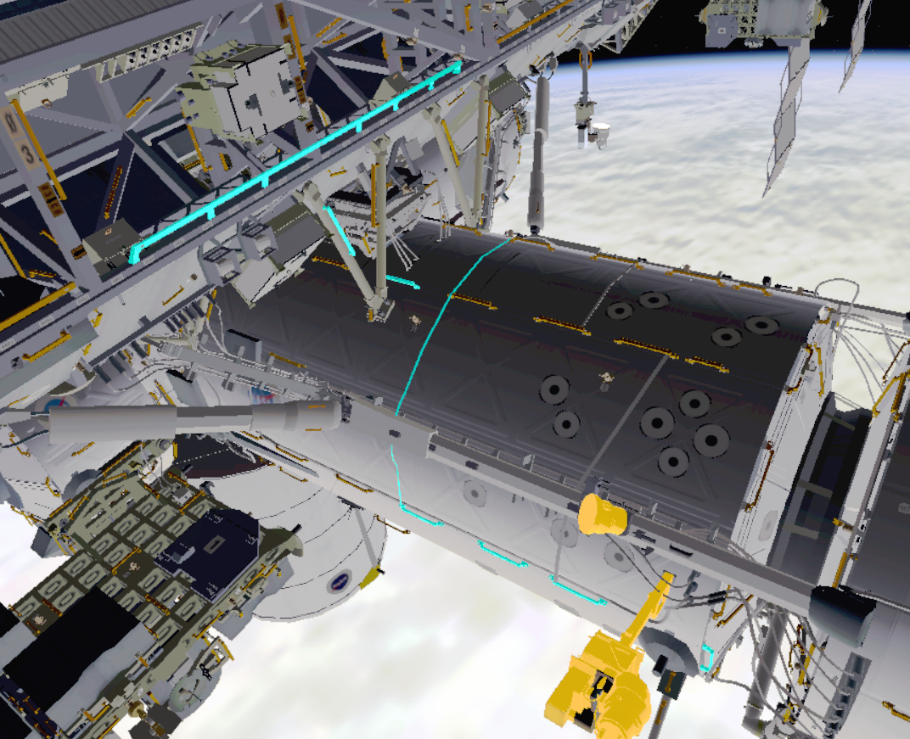
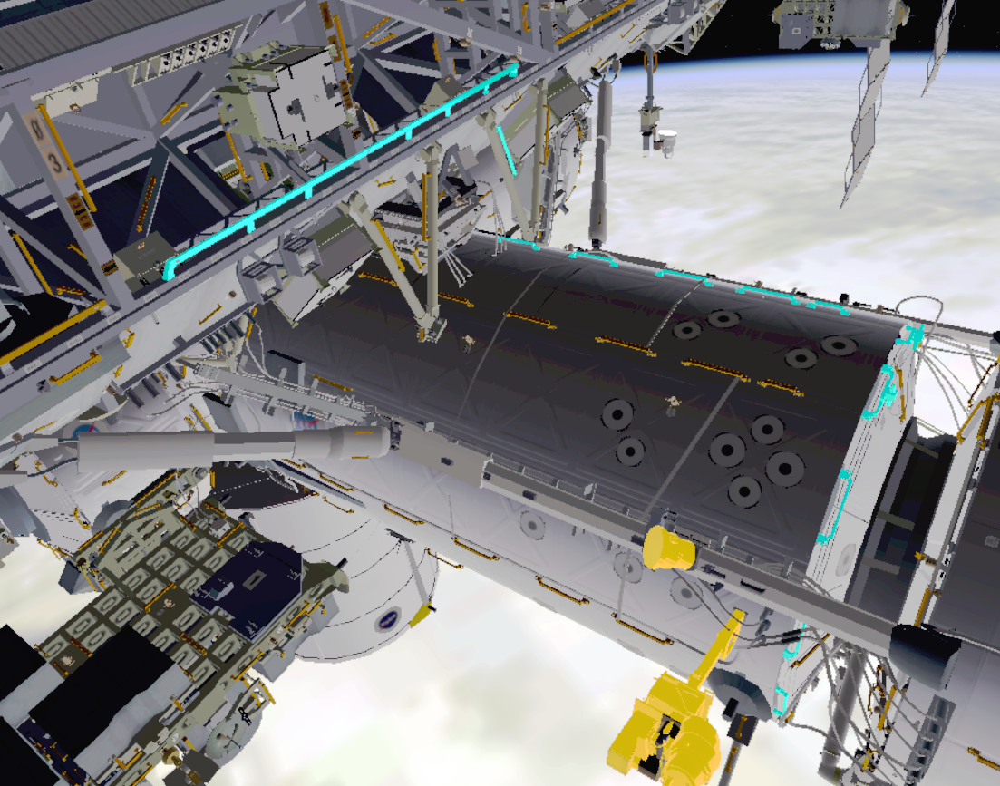
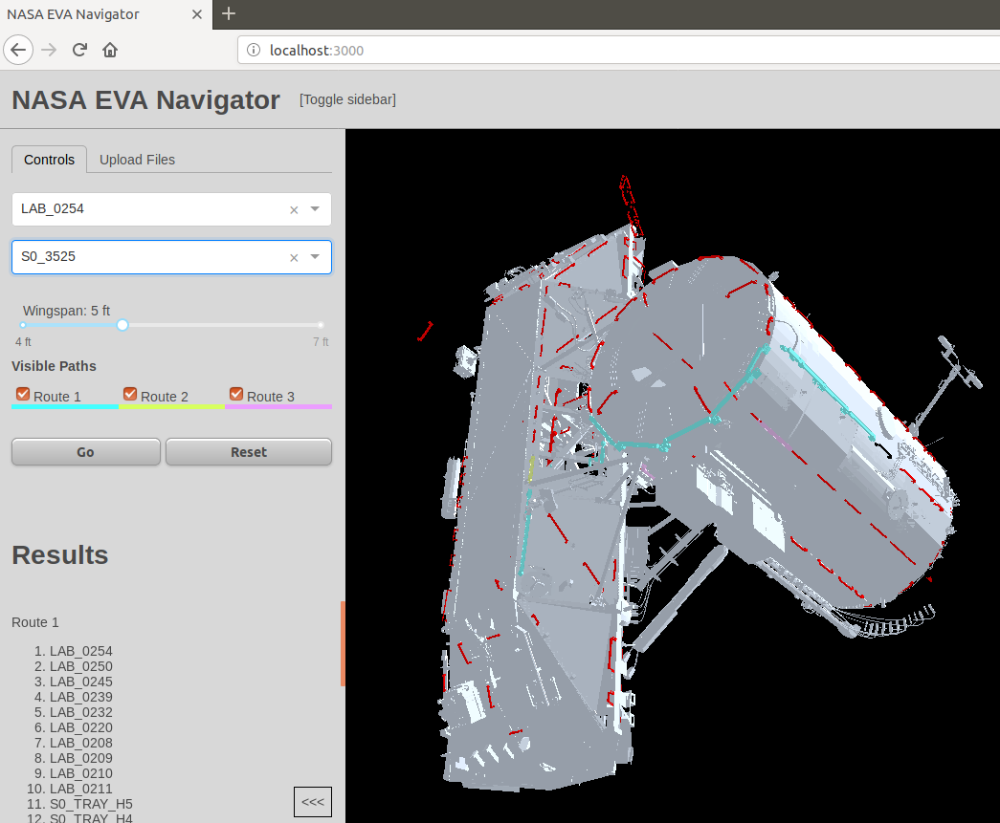
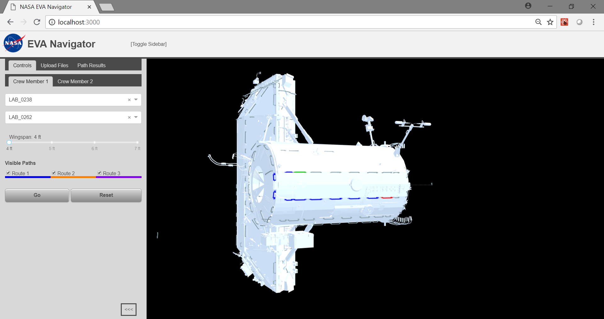
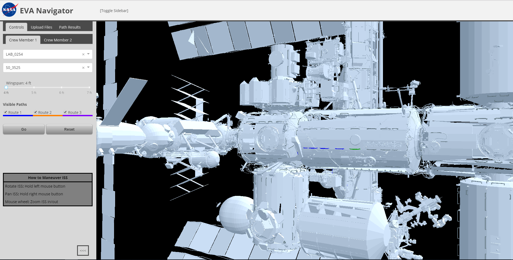

# EVANav
Navigation for space walks

## GENERAL CONCEPT
Imagine using Google Maps and Navigation, but as a space walker on the Space Station.

Flight controllers and astronauts at NASA use a 3D model of the International Space Station (ISS) to aid in the planning and execution of ExtraVehicular Activity (EVA, or "space walks"). This model (named "DOUG") includes all of the modules and hardware on ISS as well as each handrail used by an EVA crew member to aid in translation. Visit the [NASA Software](https://software.nasa.gov/software/MSC-23586-1) site to request a copy of the DOUG application.

Determining the "best" path from one location on ISS to another is currently done by trained, experienced humans. This project is to use computing power to aid those humans.

The user interface should allow for selection of start and end points, each different handrails. The user may also choose options for the route. The default will be the shortest route, but the user may want the route that encounters the least amount of hazards (sharp edges, radiating hardware, articulating structures, shatterable materials, etc), a route that deconflicts their partner's route (EVAs are performed by a pair of crew), a route including one or more waypoints in the middle of the route, and/or a route with the fewest number of rotations and plane changes. The user may also choose to enter the value for the crew member's wingspan. This is important in places where handrails are spaced farther apart than some people's reach limit. 

The user may also want to consider Safety Tether routing. Each of the two crew members wears a Safety Tether, a coiled spool of braided steel cable, that connects them to a point on ISS. Usually the anchor hook is attached to a point just outside of the EV hatch. As the two crew members translate around structure, their tether might drag across articulating structures or delicate materials. EVA planners must guide the crew members how to fairlead their tether at points to keep their tethers from snagging on the wrong places.

This algorithm will consider all the inputs to calculate the ideal route and output the results. The basic output should be a sequential list of handrail numbers and the distance between each pair of handrails along the path. A long term goal is to output the results in a way that DOUG can read so the path can be highlighted and centered in the viewing frame.

## EXAMPLE OF ALTERNATE ROUTES
Suppose an EV crew member is on the starboard/forward edge of the Lab and needs to translate to S0 forward. The two images below show alternate paths. One may be more direct, but it forces the crew member to translate near sensitive hardware. The other path goes around the sensitive hardware, but may take longer.

In this path, the crew member must maneuver around the sensitive hardware highlighted in yellow:

In this path, the crew member is routed away from the sensitive hardware, but the path is longer:

## REQUIREMENTS & ASSUMPTIONS
1. For this project, assume only handrails can be used to aid in translation (though it is common for EV crew to use structural beams in places where handrails are sparse).
1. UI should include start and end points
1. UI should allow optional waypoints in the middle of the route
1. UI should allow for two simultaneous routes (one for each crew member)
1. UI should allow options for route determination
   1. Avoid crew hazards (things that hurt the crew or their suit)
   1. Avoid hardware hazards (things that could by hurt by the crew)
   1. Deconflict partner's route (don't use the same handrails)
   1. Deconflict safety tethers from crossing each other and from crossing hazards
   1. Minimize rotations and plane changes (movement from one face to another around a module)
   1. Field to enter crew member's wingspan
1. Output should include sequential list of handrail numbers, including distance between each pair of handrails
1. Output should be in a format readable by DOUG
1. Output should optionally suggest safety tether fairlead locations

## OUTPUT FORMAT
Ideally the model should be represented using nodes on a graph (a scene-graph). Each node in the graph would contain a transformation of the frame that its model and child nodes would be relative to.  The following is a sample of how a scene-graph for a simple camera model could be defined and is actually a format that DOUG can read.  In DOUG all units are in inches and degrees.

The following is a sample:

    camera_A
    SYSTEM
    0 0 0
    0 0 0
    NULL
        camera_pan_A
        camera_pan_model.stl
        0 0 0
        0 0 0
        camera_A
            camera_tilt_A
            camera_model.stl
            0 0 2.0
            0 0 0
            camera_pan_A

The indentation is not required but is included above to show the relationship between the nodes.

DOUG uses a right-handed coordinate system where <pitch> is rotation about the 'Y-axis', <yaw> is rotation about the 'Z-axis' and <roll> is about the 'X-axis' and is typically applied in Pitch-Yaw-Roll order.

Each node is represented with 5 consecutive lines of text in the file with the following format.

    <unique_node_name>
    <geometry_file_name> or "SYSTEM"
    <x> <y> <z>
    <pitch> <yaw> <roll>
    <parent_node_name> or "NULL"

## Public/models/Handrails
* stage_55-6_v12_nohandles_binary.zip     - Contains a text based data format of the geometry of the entire ISS model without handles (converted in binary for efficiency -unzip in the same folder-)
* Frames/                   - Contains all handrails listed in Entire_ISS.str as STL files
  * Entire_ISS.str file contains the location and orientation information for each handrail

## SAMPLE DATA
* LAB_S0_geometry.stl     - Contains a text based data format of the geometry of the US Lab and S0 truss of the ISS
* Handrails/
  * LABHANDHOLDS/           - Contains Lab handrails as STL files
  * LABHANDHOLDS.str        - Struct file containing xyz/PYR of each handrail on Lab
  * S0HANDHOLDS/            - Contains S0 truss handrails as STL files
  * S0HANDHOLDS.str         - Struct file containing xyz/PYR of each handrail on S0 truss
* ISS_handle_location.str     - Contains raw data as we received

The .str files contain the location and orientation information for each handrail, saved with 5 lines.
* NodeName
* Modelname
* x y z
* pitch yaw roll
* ParentNode

## RELATED WORK
See [ISSMaps](https://github.com/darenwelsh/ISSMaps), my first attempt at this. I didn't get very far, but it may be helpful.

### Phase 1 - Fall 2017 Semester
See [NASA Path Finder](https://github.com/lovetostrike/nasa-path-finder), a project by graduate students in the University of Maryland University College Software Engineering (SWEN 670) course to implement this idea (fall 2017 semester). 

This group accomplished the following aspects:
* Back end to calculate shortest handrail paths
* Front end accessed via localhost:3000
* Dropdowns for start/end points
* Slider for wingspan (I don't think this is factored into the calculation yet)
* Selection boxes for 3 possible routes
* 3d model visualization of ISS model with routes
* Handrail list (does not include distance between each handrail pair)
* Ability to upload model files (I have not tested this)

Here is a screenshot of the front end as of fall 2017:

### Phase 2
See the [Phase 2 repo](https://github.com/xpaddict/nasa-path-finder).

### Phase 3 - Summer 2018 Semester
For Phase 3 clone of darenwelsh/EVANav, please click here: [lincolnpowell/nasa-path-finder](https://github.com/lincolnpowell/nasa-path-finder).

This group completed the following feature requests:
* Add extra highlighting or some halo effect to make start and end points more obvious in 3D model
* Allow users to click a handrail in the 3D model to select start and end points
* Can the movement controls be improved to allow for 3-axis movement and 3-axis rotation?
* Use the wingspan slider input to effect the potential paths calculated
* Add distances between each handrail pair in each path

Here is a screenshot of the front-end as of summer 2018 Milestone 4:

### Phase 4 - FALL 2018 Semester
For Phase 4 clone of [darenwelsh/EVANav](https://github.com/darenwelsh/EVANav), please click here: [claudelguembu/nasa-path-finder](https://github.com/claudelguembu/nasa-path-finder).

**Phase 4 Note: Before running the bat file, unzip, in the same folder, the station file locate in public/models/handrails.**

This group completed the following:
* Update model to include all of ISS and its handrails
* Provide a legend on how to manoeuver the ISS model
* Altered ISS model brightness
* Fixed wingspan value on the result path and log file.
* Properly fixed Path result showing up in Control (old solution was using < br/>)
* Improved running time when determining path.
* Automatically load ISS model and handrails (off the str file) on load
* Clear the path result tab when the user click on reset

Here is a screenshot of the front-end as of Phase 4:

### Forward work
Reference [open issues](https://github.com/darenwelsh/EVANav/issues) for bugs and feature requests that might not be listed below.

Here is a non-exhaustive list of remaining work:
1. Verify basic functionality (**Note**: _This is a reoccuring item required for all project teams_)
1. ~Update model to include all of ISS (data is provided in [0.2.0 release](https://github.com/darenwelsh/EVANav/releases/tag/0.2.0))~
1. ~Provide a legend/key on how to maneuver ISS~
1. ~Can the movement controls be improved to allow for 3-axis movement and 3-axis rotation?~
1. ~Add extra highlighting or some halo effect to make start and end points more obvious in 3d model~
1. ~Use the wingspan slider input to effect the potential paths calculated~
1. ~Add distances between each handrail pair in each path~
1. Add indications of when axial direction and plane changes (e.g. from port to zenith or from face 1 to face 2)
1. ~Allow users to click a handrail in the 3d model to select start and end points~
1. Add UI and update calculation based on volume and orientation of space suit (maybe display tube illustrating path traversed by suit extremeties)
1. Add UI and update calculation to avoid hazards
1. Add UI and update calculation accounting for 2 crew members, to deconflict routes
1. Add UI and update calculation to allow additional waypoint(s)
1. Add UI and update calculation to minimize suit rotations and plane changes (translating around corners and edges)
1. Display tether routing
1. Deconflict tethers from two crew
1. Suggest minimal fairleads to avoid hazards
1. Integrate output into DOUG application 
1. Verify functionality of UI to drag and drop new model file
1. Add UI allowing user to specify starboard and port SARJ angles (and other articulating structures?)
1. Add UI allowing user to specify location of MT and CETA Carts
1. Add UI option to choose optimal path for 1G environment (in the NBL) instead of optimal path for microgravity

## Basic install instructions
1. Download and install git: https://git-scm.com/downloads
1. Download and install latest nodejs: https://nodejs.org/download/
1. Install yarn globally. After node is installed you run this in a cmd window: `npm install yarn -g`
1. Install Google chrome: https://www.google.com/chrome/ (testing has shown Edge may peform better than Chrome)
1. Install python: https://www.python.org/downloads/windows/
1. Install Java jdk (11.0.1+): https://www.oracle.com/technetwork/java/javase/downloads/index.html
1. Edit environment variables
   1. In Search, search for and then select: Advanced system settings
   1. Click Environment Variables.
   1. In the section System Variables, click New. Then add `JAVA_HOME` (the value is the location of your java jdk, such as `C:\Program Files\Java\jdk-11.0.1`)
1. Download apache maven: https://maven.apache.org/download.cgi
   1. Unzip to a folder (such as `c:\apache-maven-3.6.0`)
   1. Navigate to your environment variable (as performed in the previous step)
   1. In the section System Variables, find the Path environment variable and select it (if Path doesn’t exist, you’d need to create one). Add the bin folder of maven as a new entry in the Path’s edit view (such as `C:\apache-maven-3.6.0\bin`).
1. Open cmd and navigate to C:
1. Clone this repo: `git clone https://github.com/darenwelsh/EVANav.git`)
1. Navigate to the handrails folder and unzip the ISS model file. `stage_55-6_v12_nohandles_binary.stl` should end up in the ..\EVANav\public\models\Handrails directory.
1. Execute `run_nasa.bat` in the EVANav directory
1. 3 windows will pop up. Allow them to run until 2 say "Press any key to continue" and the other says "Running at port 8080".
1. Close all 3 windows
1. Execute `run_nasa.bat` again
1. Allow time for the browser to load. You may see better results from Edge than Chrome. You may have to refresh the browser after a couple minutes.
